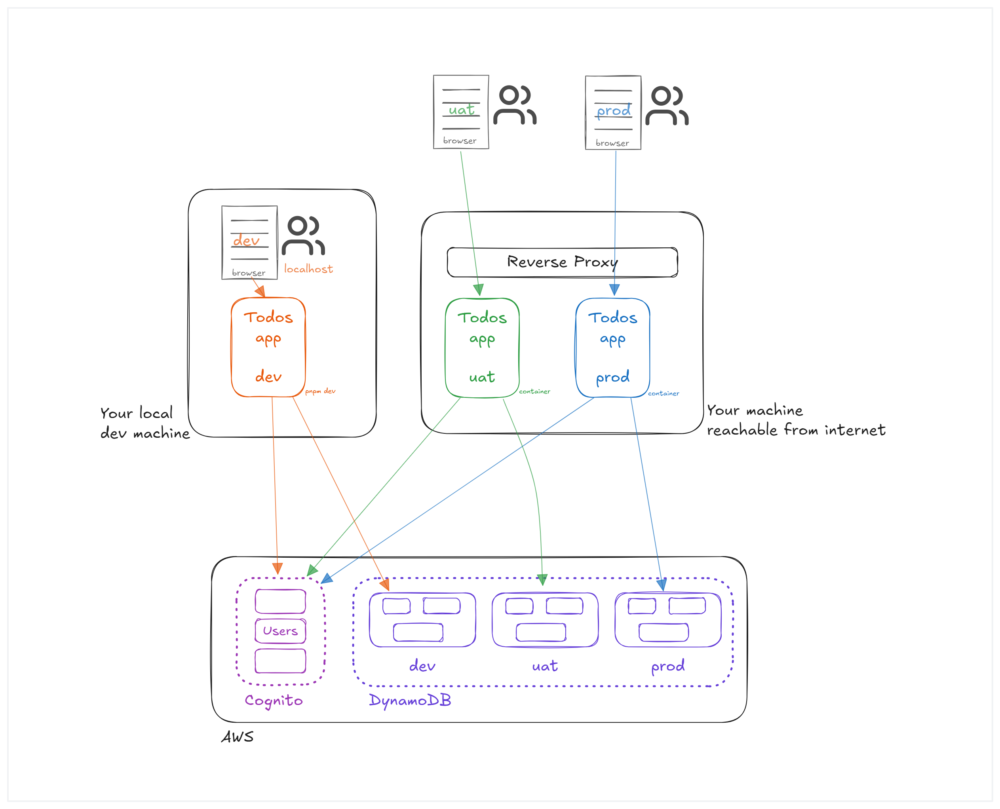

# Architecture

The following diagram shows the setup of the app environments
and how the components are connected to each other.

## Dev

The `dev` environment is started on your local machine. It is
used for the implementation of the app and for a first testing.

You open `localhost` on that machine to browse through the app.

## UAT and Prod

The `uat` and `prod` environments are started on a separate
machine that must be reachable from the internet.

In my setup, both environments are running on the same machine. But of
course you can do it however you like. You can also skip the whole
`uat` setup and just use `prod`. But for me it is always
helpful to first deploy a new version to the `uat` environment and see
if everything works fine.

## AWS

All three environments use AWS resources for the users and
the data. While the same users are used throughout all three
environments, the data is stored in different database tables.

We use AWS Cognito for the user pool and DynamoDB for the data.
