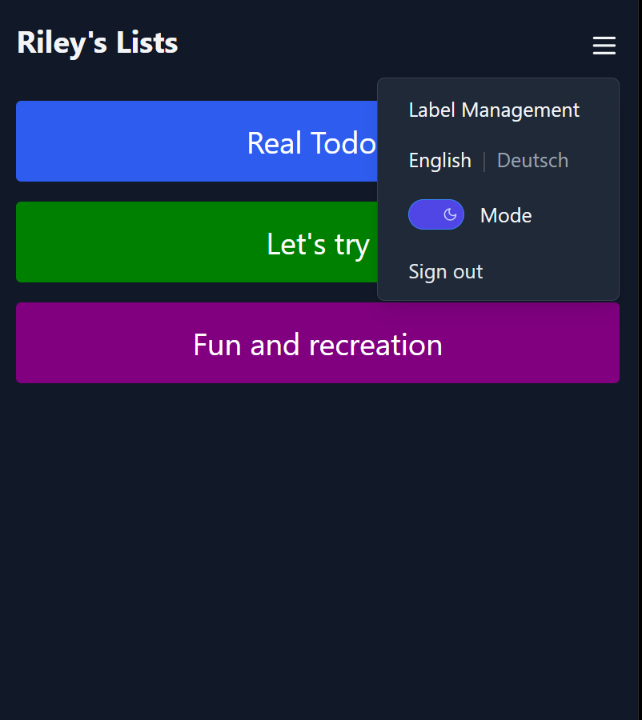

# Gallery

## Home Screen

The home screen, showing all task lists that are available to the user.

---

Dark mode available throughout the app.

## Label Management

The label management screen, allowing to create, edit, and delete labels.  
Only labels that are not in use can be deleted.

## Sign In

The sign in screen.  
Changing one's password is supported for the case that the user entry
in AWS Cognito is configured accordingly.

## Task Management

Clicking one of the task lists will lead to the task management screen,
showing the leftmost board column "Backlog".

---

Clicking or tapping on one of the tasks opens the details of that task. Also
the tools bar is then available for editing, moving, and deleting the task.

Moving can be done up and down in the same board column or between board columns.

---

Tasks can be filtered by label.

---

Dark mode and localization are available. The localization refers to all
texts in the app, all labels created by the user, and the board column names.

---

Editing a task lets you modify title, details, and labels.

---

Labels can also be created while editing tasks for a faster task creation
without a lot of clicking.

